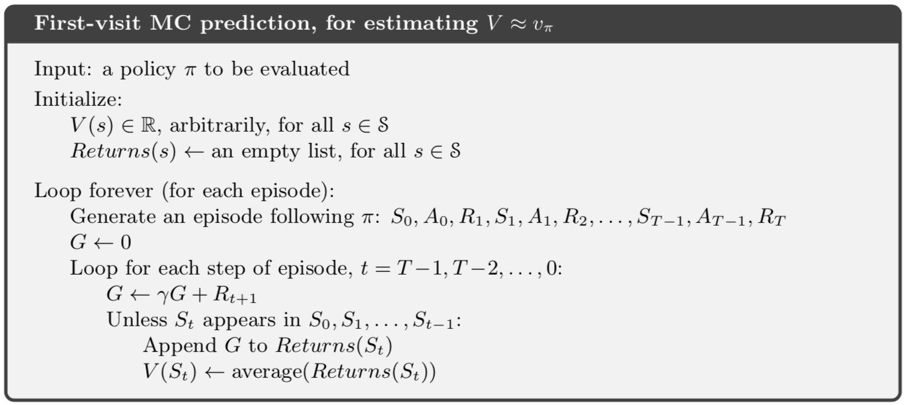
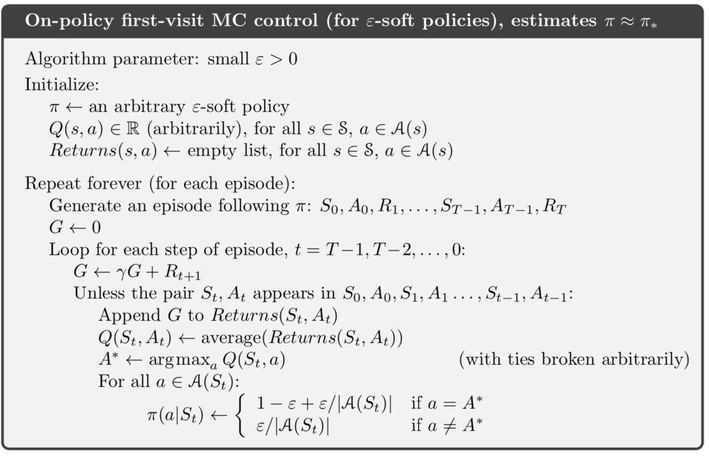

# BLACK JACK GAME

#### This repo is a python implementation of the black jack game as demonstrated by the [Open AI gym](https://gym.openai.com/envs/Blackjack-v0/)

## Algorithms used 
* On-policy first visit __Monte-Carlo prediction__

* On-policy first visit __Monte-Carlo control__

#### References

1. [Open AI gym](https://gym.openai.com)
2. [Analytics Vidya blog post](https://www.analyticsvidhya.com/blog/2018/11/reinforcement-learning-introduction-monte-carlo-learning-openai-gym/)
3. [Professor David Silver Slides](http://www0.cs.ucl.ac.uk/staff/d.silver/web/Teaching.html)