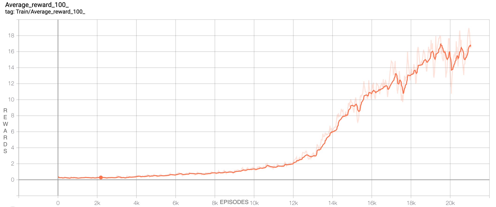

## Deep-Q-Learning

This repo is an implementation of deep-q-learning. It demonstrates the agent learning to play atari breakout using pytorch

#### Requirements:
1. Python3
2. Gym
3. Pytorch

#### Usage:
- To train the agent:

    `python main.py --train_dqn`

- To test the agent:

    `python main.py --test_dqn --model_test_path "trained_model_path"`
    

#### Results:

- In Training:

- Running the agent for 100 episodes
    - Average reward: 64
    
 